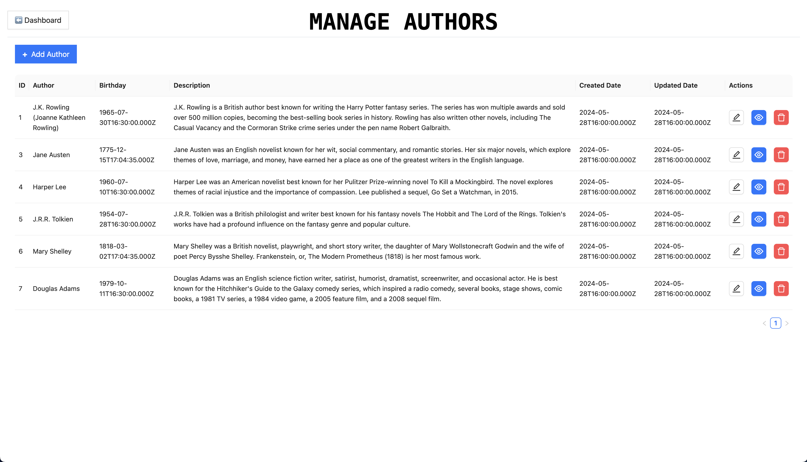

This project is a full-stack web application built using React.js for the frontend, Express.js for the backend, and MySQL as the database. It demonstrates the implementation of a 3-tier architecture, where the presentation layer (React.js), application logic layer (Express.js), and data layer (MySQL) are separated into distinct tiers. Below are the detailed steps to deploy this application on a cloud platform using two EC2 instances.

Prerequisites

Infrastructure Setup:

Create 2 new EC2 instances (one for frontend and one for backend).

Create a security group (SG) with appropriate inbound and outbound rules.

Generate a key pair for secure SSH access.

Set up a VPC with subnets for the instances.

Instance Usage:

Frontend Server: Host the React.js application and act as a bastion server to connect to the backend.

Backend Server: Host the Express.js backend and MySQL database. Only allow connections from the bastion server.

Bastion Server Setup

Transfer Private Key: From the local machine, securely copy the private key of the backend server to the bastion server:

scp -i <path-to-local-key> <path-to-backend-private-key> ec2-user@<bastion-server-ip>:<destination-path>

Set Permissions: Ensure the key file is readable only by the owner:

chmod 400 <key-file-path>

SSH Access: Use the bastion server to SSH into the backend server:

ssh -i <backend-private-key> ec2-user@<backend-server-ip>

Frontend Server Setup (Ubuntu)

Install Git:

sudo apt update
sudo apt install git -y

Clone Repository:

git clone https://github.com/GruhanthP/CRUD-bookkeeper-app.git

Install Node Version Manager (NVM):

curl -o- https://raw.githubusercontent.com/nvm-sh/nvm/v0.39.7/install.sh | bash
source ~/.bashrc

Install Node.js:

nvm install --lts
node -e "console.log('Running Node.js ' + process.version)"

Setup Frontend: Navigate to the frontend directory and install dependencies:

cd CRUD-bookkeeper-app/frontend
npm install

Backend Server Setup (Ubuntu)

Install Git and Clone Repository:

sudo apt update
sudo apt install git -y
git clone https://github.com/GruhanthP/CRUD-bookkeeper-app.git

Install Node.js and NVM: Repeat steps from the frontend server setup to install NVM and Node.js.

Install MySQL:

wget https://dev.mysql.com/get/mysql-apt-config_0.8.24-1_all.deb
sudo dpkg -i mysql-apt-config_0.8.24-1_all.deb
sudo apt update
sudo apt install mysql-server -y
sudo systemctl start mysql
sudo systemctl enable mysql
sudo grep 'temporary password' /var/log/mysql/error.log

Set Up MySQL Root Password: If no temporary password is generated:

sudo mysql -u root
ALTER USER 'root'@'localhost' IDENTIFIED WITH mysql_native_password BY '<YourNewPassword>';
FLUSH PRIVILEGES;
EXIT;

Secure MySQL Installation:

sudo mysql_secure_installation

Start Backend: Navigate to the backend directory and install dependencies:

cd CRUD-bookkeeper-app/backend
npm install
pm2 start app.js

Test API Connection: Use the following command to test the backend:

curl http://localhost:<backend-port>/books

Frontend Server Setup (RedHat)

Install Git:

sudo yum update -y
sudo yum install git -y

Clone Repository:

git clone https://github.com/GruhanthP/CRUD-bookkeeper-app.git

Install Node Version Manager (NVM):

curl -o- https://raw.githubusercontent.com/nvm-sh/nvm/v0.39.7/install.sh | bash
source ~/.bashrc

Install Node.js:

nvm install --lts
node -e "console.log('Running Node.js ' + process.version)"

Setup Frontend: Navigate to the frontend directory and install dependencies:

cd CRUD-bookkeeper-app/frontend
npm install

Backend Server Setup (RedHat)

Install Git and Clone Repository:

sudo yum update -y
sudo yum install git -y
git clone https://github.com/GruhanthP/CRUD-bookkeeper-app.git

Install Node.js and NVM: Repeat steps from the frontend server setup to install NVM and Node.js.

Install MySQL:

wget https://dev.mysql.com/get/mysql80-community-release-el9-1.noarch.rpm
sudo rpm -Uvh mysql80-community-release-el9-1.noarch.rpm
sudo yum install mysql-server -y
sudo systemctl start mysqld
sudo systemctl enable mysqld
sudo grep 'temporary password' /var/log/mysqld.log

Set Up MySQL Root Password: If no temporary password is generated:

sudo mysql -u root
ALTER USER 'root'@'localhost' IDENTIFIED WITH mysql_native_password BY '<YourNewPassword>';
FLUSH PRIVILEGES;
EXIT;

Secure MySQL Installation:

sudo mysql_secure_installation

Start Backend: Navigate to the backend directory and install dependencies:

cd CRUD-bookkeeper-app/backend
npm install
pm2 start app.js

Test API Connection: Use the following command to test the backend:

curl http://localhost:<backend-port>/books

Nginx Setup (Optional)

Install Nginx (Ubuntu):

sudo apt update
sudo apt install nginx -y

Install Nginx (RedHat):

sudo yum update -y
sudo yum install nginx -y

Configure Nginx: Update the Nginx configuration file to set the correct path for the frontend’s index.html file and use Nginx as a reverse proxy for the backend.

Restart Nginx:

sudo systemctl restart nginx

Notes

Security: Ensure that your security group allows only the required inbound traffic.

Environment Variables: Update the backend configuration file with the correct MySQL root password.

Database Connection: Verify the database connection string in the backend configuration.


This project is a full-stack web application built using React js for the frontend, Express js for the backend, and MySQL as the database. The application is designed to demonstrate the implementation of a 3-tier architecture, where the presentation layer (React js), application logic layer (Express js), and data layer (MySQL) are separated into distinct tiers.
We have a frontend reactjs application and backend nodejs with mysql db this has to be hosted on a cloud platform


## User Interface Screenshots 
#### Dashboard


#### Books


#### Authors



## Connecting to private EC2 instance via a bastion host
1. To change the ssh key permission:

```bash
chmod 400 your_key.pem
```

2. To start ssh agent:

```bash
eval "$(ssh-agent -s)"  
```

3. To add key to ssh agent:

```bash
ssh-add your_key.pem
```

4. To ssh into bastion host with agent forwarding:

```bash
ssh -A ec2-user@bastion_host_public_ip
```

5. To connect private instance from the bastion host:

```bash
ssh ec2-user@private_instance_private_ip 
```

## Setting up the Data Tier
#### Install MySQL
1. To download MySQL repository package:

```bash
wget https://dev.mysql.com/get/mysql80-community-release-el9-1.noarch.rpm
```

2. To verify the package download:

```bash
ls -lrt 
```

3. To install MySQL repository package:

```bash
sudo dnf install -y mysql80-community-release-el9-1.noarch.rpm 
```

4. To import GPG key: 

```bash
sudo rpm --import https://repo.mysql.com/RPM-GPG-KEY-mysql-2023 
```

5. To update package index:

```bash
sudo dnf update –y 
```

6. To install MySQL server:

```bash
sudo dnf install -y mysql-community-server  
```

7. To start the mysql service:

```bash
sudo systemctl start mysqld
```

8. To enable mysql to start on boot:

```bash
sudo systemctl enable mysqld 
```

9. To secure the mysql installation:

```bash
sudo grep 'temporary password' /var/log/mysqld.log 

sudo mysql_secure_installation 
```

10. To create database and restore data, please refer SQL scripts on [db.sql](./backend/db.sql) file.


## Setting up the Application Tier
#### Install GIT
```bash
sudo yum update -y

sudo yum install git -y

git — version
```

#### Clone repository
```bash
git clone https://github.com/learnItRightWay01/react-node-mysql-app.git
```

#### Install node.js
1. To install node version manager (nvm)
```bash
curl -o- https://raw.githubusercontent.com/nvm-sh/nvm/v0.39.7/install.sh | bash
```

2. To load nvm
```bash
source ~/.bashrc
```

3. To use nvm to install the latest LTS version of Node.js
```bash
nvm install --lts
```

4. To test that Node.js is installed and running
```bash
node -e "console.log('Running Node.js ' + process.version)"
```

## Setting up the Presentation Tier
#### Install GIT
```
PLEASE REFER ABOVE
```

#### Clone repository
```
PLEASE REFER ABOVE
```

#### Install node.js
```
PLEASE REFER ABOVE
```

#### Install NGINX
```bash
dnf search nginx

sudo dnf install nginx

sudo systemctl restart nginx 

nginx -v
```

#### Copy react.js build files
```bash
sudo cp -r dist /usr/share/nginx/html 
```

#### Update NGINX config
1. Server name and root
```
server_name    domain.com www.subdomain.com
root           /usr/share/nginx/html/dist
```

2. Setup reverse proxy
```
location /api { 
   proxy_pass http://application_tier_instance_private_ip:3200/api; 
}
```

3. Restart NGINX
```
sudo systemctl restart nginx
```

## User data scripts
#### Install NGINX
For [AWS solutions - 06](https://youtu.be/snQlL0fJI3Q) and  [AWS solutions - 07](https://youtu.be/eRX1FI2cFi8)

```bash
#!/bin/bash 
# Update package lists 
yum update -y 

# Install Nginx 
yum install -y nginx 

# Stop and disable default service (optional) 
systemctl stop nginx 
systemctl disable nginx 

# Create a custom welcome message file 
echo "Welcome to Presentation Tier EC2 instance in Availability Zone B." > /usr/share/nginx/html/index.html 

# Start and enable the Nginx service 
systemctl start nginx 
systemctl enable nginx
```
